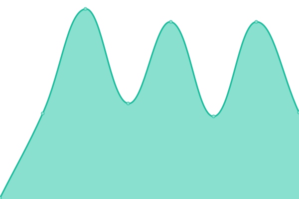
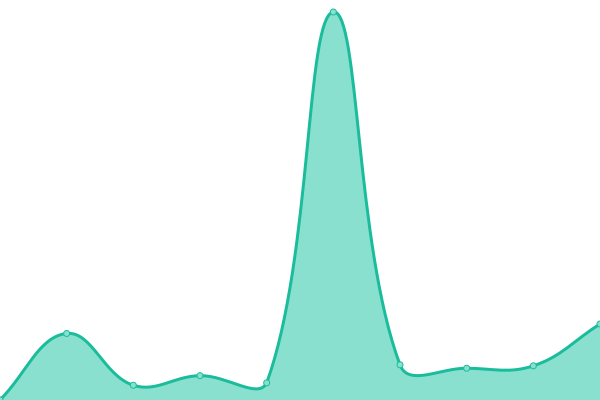

# [📈 Live Status](https://hub-xp.github.io/testfy-status/): <!--live status--> **🟧 Partial outage**

This repository contains the open-source uptime monitor and status page for [Upptime](https://upptime.js.org), powered by [Upptime](https://github.com/upptime/upptime).

With [Upptime](https://upptime.js.org), you can get your own unlimited and free uptime monitor and status page, powered entirely by a GitHub repository. We use [Issues](https://github.com/upptime/upptime/issues) as incident reports, [Actions](https://github.com/hub-xp/testfy-status/actions) as uptime monitors, and [Pages](https://hub-xp.github.io/testfy-status/) for the status page.

<!--start: status pages-->
<!-- This summary is generated by Upptime (https://github.com/upptime/upptime) -->
<!-- Do not edit this manually, your changes will be overwritten -->
<!-- prettier-ignore -->
| URL | Status | History | Response Time | Uptime |
| --- | ------ | ------- | ------------- | ------ |
|  [[PROD] Site e Loja](https://testfy.com.br/) | 🟩 Up | [prod-site-e-loja.yml](https://github.com/hub-xp/testfy-status/commits/HEAD/history/prod-site-e-loja.yml) | 

 589ms
     
 | 

<a href="https://hub-xp.github.io/testfy-status/history/prod-site-e-loja">100.00%</a>
    

|  [[PROD] Professionals](https://pro.testfy.com.br/) | 🟩 Up | [prod-professionals.yml](https://github.com/hub-xp/testfy-status/commits/HEAD/history/prod-professionals.yml) | 

 255ms
     
 | 

<a href="https://hub-xp.github.io/testfy-status/history/prod-professionals">100.00%</a>
    

|  [[PROD] Workspace](http://workspace.testfy.com.br/) | 🟩 Up | [prod-workspace.yml](https://github.com/hub-xp/testfy-status/commits/HEAD/history/prod-workspace.yml) | 

 350ms
     
 | 

<a href="https://hub-xp.github.io/testfy-status/history/prod-workspace">94.17%</a>
    

|  [[PROD] API](https://api.testfy.com.br/public/healthcheck/liveness) | 🟩 Up | [prod-api.yml](https://github.com/hub-xp/testfy-status/commits/HEAD/history/prod-api.yml) | 

 349ms
     
 | 

<a href="https://hub-xp.github.io/testfy-status/history/prod-api">99.67%</a>
    

|  [[STAGE] Backoffice (novo)](https://workspace-stage.testfy.com.br/) | 🟩 Up | [stage-backoffice-novo.yml](https://github.com/hub-xp/testfy-status/commits/HEAD/history/stage-backoffice-novo.yml) | 

 395ms
     
 | 

<a href="https://hub-xp.github.io/testfy-status/history/stage-backoffice-novo">100.00%</a>
    

|  [[STAGE] Store (nova)](https://store-stage.testfy.com.br/) | 🟩 Up | [stage-store-nova.yml](https://github.com/hub-xp/testfy-status/commits/HEAD/history/stage-store-nova.yml) | 

 497ms
     
 | 

<a href="https://hub-xp.github.io/testfy-status/history/stage-store-nova">99.78%</a>
    

|  [[PROD] Portainer](https://portainer.testfy.com.br/) | 🟥 Down | [prod-portainer.yml](https://github.com/hub-xp/testfy-status/commits/HEAD/history/prod-portainer.yml) | 

 0ms
     
 | 

<a href="https://hub-xp.github.io/testfy-status/history/prod-portainer">0.00%</a>
    

<!--end: status pages-->

[**Visit our status website →**](https://hub-xp.github.io/testfy-status/)

## 📄 License

- Powered by: [Upptime](https://github.com/upptime/upptime)
- Code: [MIT](./LICENSE) © [Upptime](https://upptime.js.org)
- Data in the `./history` directory: [Open Database License](https://opendatacommons.org/licenses/odbl/1-0/)
